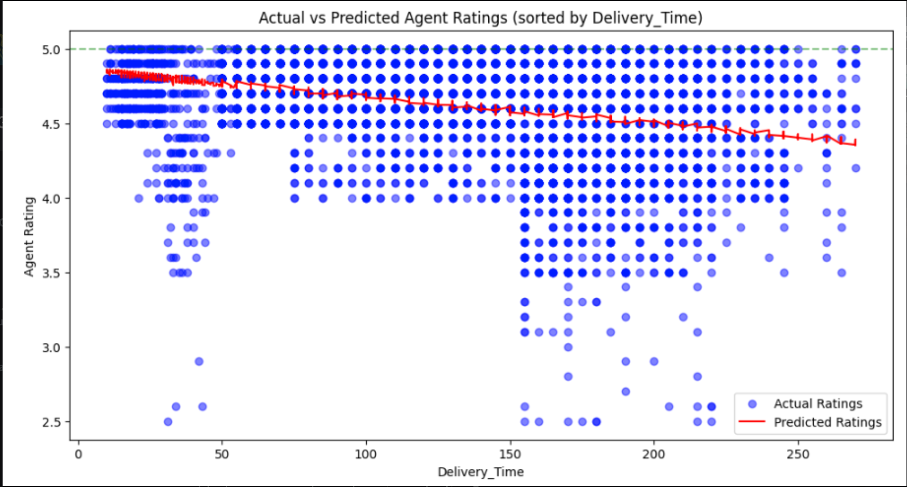

# ABSTRACT
Our project aims to use the Amazon Delivery Dataset to predict the ratings of Amazon delivery agents using machine learning algorithms and techniques. The dataset encompasses over 43,632 delivery records across multiple cities, detailing various attributes such as order details, delivery agents' demographics, latitudinal and longitudinal coordinates of stores and delivery locations, order and delivery timestamps, and external factors like weather and traffic conditions. By analyzing these features, the project aims to identify patterns and correlations that influence delivery agents' performance ratings.
The objective is to build and evaluate predictive models that can accurately estimate an agent's rating based on the provided attributes. This analysis will not only enhance the understanding of key factors affecting delivery efficiency but also contribute to the improvement in logistical operations.

Dataset: https://www.kaggle.com/datasets/sujalsuthar/amazon-delivery-dataset

# MILESTONE 2   

## Data Exploration

The dataset used in this project consists of various attributes related to Amazon deliveries. The exploration step involves evaluating the data, understanding the number of observations, data distributions, scales, missing data, and column descriptions.

### Data Summary

- **Number of Observations:** The dataset contains several thousand rows and multiple columns.
- **Column Descriptions:** 
  - Detailed descriptions of each column can be found in the notebook. 
  - Example columns include delivery time, agent ID, and customer rating.
- **Missing Data:** 
  - Missing data was identified and handled appropriately. 
  - Strategies included filling missing values with the mean, median, or mode of the column, or dropping rows/columns with excessive missing values.

### Data Distributions

- **Numerical Data:** 
  - Histograms and box plots were created for numerical columns to understand their distributions.
  - For example, delivery times and agent ratings were visualized to check for normality and outliers.
- **Categorical Data:** 
  - Bar charts were plotted for categorical columns to visualize the frequency of each category.
  - Examples include the frequency of different delivery locations or types of delivery vehicles.

## Data Visualization

Visualization is crucial for understanding the relationships between different attributes in the dataset.

### Scatter Plots

Scatter plots were used to visualize relationships between pairs of numerical attributes. This helped in identifying trends and correlations that are important for predictive modeling.

### Example Visualizations

Example visualizations were included to demonstrate the variety of data present. This included visualizing the number of deliveries per agent, average ratings, and more.

## Data Preprocessing

Data preprocessing is essential for preparing the data for modeling. The preprocessing steps for this project include:

1. **Handling Missing Data:** 
   - Missing values were filled using appropriate strategies such as the mean for numerical data and the mode for categorical data.
2. **Feature Scaling:** 
   - Standardization was applied to numerical features to ensure they have a mean of 0 and a standard deviation of 1.
3. **Encoding Categorical Data:** 
   - One-hot encoding was used for categorical variables to convert them into a numerical format suitable for machine learning models.
4. **Data Splitting:** 
   - The dataset was split into training and testing sets to evaluate model performance accurately.

## QUICK OVERVIEW OF MILESTONE 2
First. we clean up the dataset. We identify columns with missing values and count the number of missing values in each, print out the columns with missing values and the count of missing values in each, and cleaning the data by dropping rows with missing values. After cleaning up the dataset, we start to creating more features so that it is more easier for us to analyze the data and for people to visualize the pattern. We use store location, including store latitude and store longitude, and drop location, including drop latitude and drop longitude, to calculate the distance between store and drop-off location. We add this feature into our dataset. We also add a delivery season feature into our dataset, which splits delivery months into four seasons, which are spring, summer, fall, and winter. We have also changed the datetime formats for order date, order time, and pickup time so that the datetime structure is consistent in the dataset. The date format we use in the dataset is Year/Month/Date, and the time format we use in the dataset is Hour/Minute/Second.

### Link to Jupyter Notebook for Milestone 2

All code and Jupyter notebooks used in this project are uploaded to this repository. You can find the detailed data exploration, visualization, and preprocessing steps in the following notebook:
[Amazon Agent Rating Prediction Jupyter Notebook for Milestone 2](Milestone2_CSE151A_Group_Project_Amazon_Agent_Rating.ipynb)

# MILESTONE 3

## PART 4
### Model fit line

Here we can see how our model predicts agent ratings with Delivery_Time as the X-axis. We can see that our fitting line is cutting in between main clusters of actual ratings. This means our predictions are achieving a good mse since the distance between our line and actual ratings is minimized.

### Next models and because
Our current model is rather simple, so we want to get a more complex model to lower the MSE and produce more accurate predictions. We are thinking of a Randomforest or GBM model because those seem to be able to lower the error rate more than our current model, and our team wants to implement something that
we have not seen implemented during class.

## PART 5 
### Training the Linear Regression Model
In Milestone 3, we focused on major preprocessing of the dataset before training our first model. After cleaning and preparing the data, we chose to use a linear regression model. This choice was motivated by the linear nature of our dataset. The goal was to predict the `Agent_Rating` based on various features, including `Agent_Age`, `Distance_Miles`, and `Delivery_Time`.

We split the dataset into training and testing sets, with 80% of the data used for training and 20% reserved for testing. The linear regression model was then trained using the training set. The performance of the model was evaluated using the mean square error (MSE) metric. For the training set, the MSE was 0.08898, and for the testing set, the MSE was 0.08912. These results indicate a consistent performance across both sets, suggesting that the model did not overfit the training data.

### Link to Jupyter Notebook for Milestone 3

All code and Jupyter notebooks used in this milestone are uploaded to this repository. You can find the detailed trained linear regression model and added preprocessing steps in the following notebook:
[Amazon Agent Rating Prediction Jupyter Notebook for Milestone 3](Milestone3_CSE151A_Group_Project_Amazon_Agent_Rating_(1).ipynb)

## PART 6
### Model Performance and Future Improvements
Our initial linear regression model demonstrated good performance, achieving a low mean square error of around 0.08. The target variable, `Agent_Rating`, ranged from 2.5 to 5.0, and the model performed well within this narrow range. Analyzing the distribution of ratings in the dataset, we found that approximately 80% of the ratings were higher than or equal to 3.5. The model predicted these higher ratings accurately.

However, the model's performance might be limited by its simplicity and the smaller amount of data for ratings between 0.0 and 3.5. When we improved the models complexity by adding a lot more features it lowered the mse by .006, which is not a lot for all the extra complexity. So it is definetly not overfiitng, however we will likely move on to a randomforest or GBM type model for our 2nd because we likely would not be able to get much more accuracy out of a simple Linear Regression type model since our model doesn't seem to be able to squeeze more performance out when we add complexity to it. One thing we are considering in the future is changing the way we measure the models by changing it so that there are bucket sizes so being able to see the effectiveness is clearer.

## QUICK OVERVIEW OF MILESTONE 3
We completed major preprocessing of our dataset and trained our first model using linear regression. The model aimed to predict `Agent_Rating` based on `Agent_Age`, `Distance_Miles`, and `Delivery_Time`, achieving a mean square error of approximately 0.08898 on the training set and 0.08912 on the testing set. Next, we evaluated the performance of our linear regression model, noting its strong performance within the higher rating range (3.5 to 5.0). However, the model may not perform as well on lower ratings (0.0 to 3.5) due to its simplicity and the limited data in this range. We suggested increasing the model's complexity and incorporating additional features to improve accuracy.

