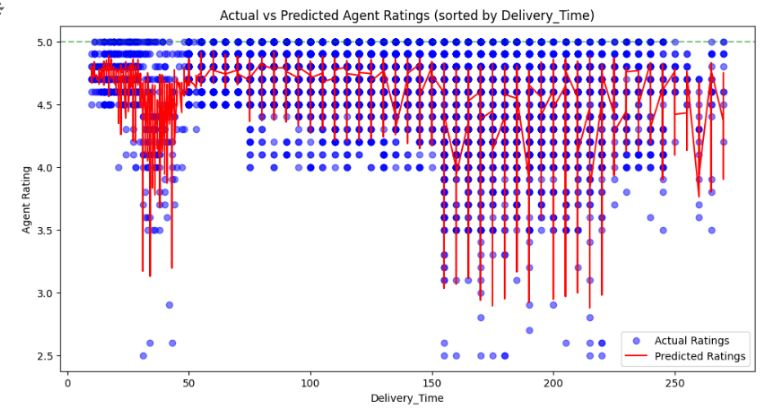
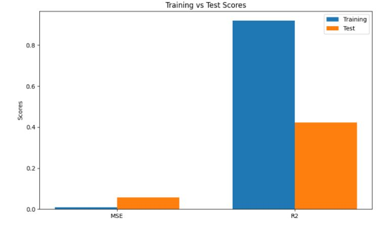
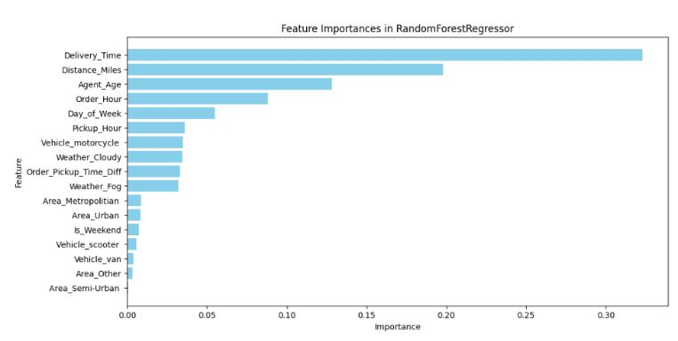
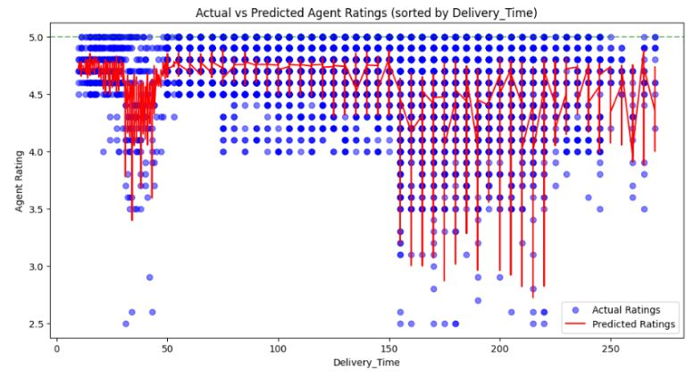
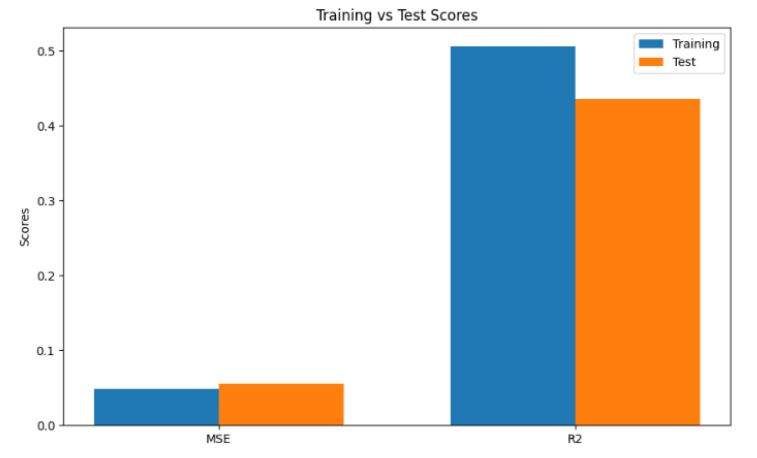
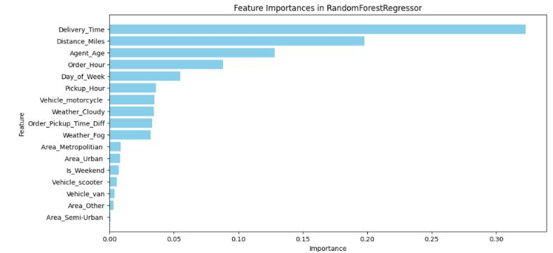
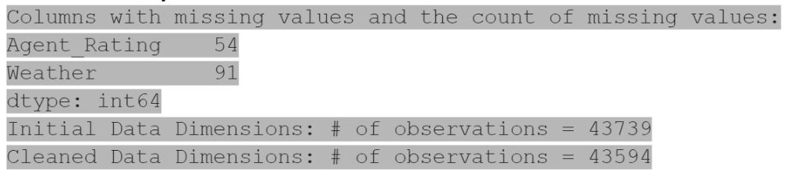

# REPORT FOR AMAZON AGENT RATING PREDICTION MODEL

## INTRODUCTION
For our project, we decided to focus on predicting the rating of Amazon delivery drivers based on several metrics. We chose this focus because a delivery driver's rating is a crucial differentiating factor among drivers. By understanding the factors that influence these ratings, we can determine how much weight should be placed on them when selecting the optimal driver for deliveries.

Our project is particularly intriguing because it provides deep insights into the rating system and identifies the most significant metrics. For example, our analysis revealed that agent age is the second most correlated factor with agent ratings. This type of analysis allows us to uncover unexpected patterns and relationships within the data.

The broader impact of developing an accurate predictive model for agent ratings is substantial. For companies, it offers a clearer understanding of what to prioritize to enhance customer satisfaction. For drivers, it highlights key areas they should focus on to improve their ratings. Overall, a reliable predictive model can ensure that the most suitable drivers are assigned to deliveries, leading to better customer experiences and more efficient operations.
## FIGURES
### Fig. 1) Distribution of Delivery Time <a name="fig1"></a>


### Fig. 2) Delivery Time vs Agent Rating <a name="fig2"></a>


### Fig. 3) Impact of Weather on Delivery Time <a name="fig3"></a>


### Fig. 4) Distribution of Agent Ratings <a name="fig4"></a>


### Fig. 5) Correlation Heatmap <a name="fig5"></a>

 
### Fig. 6) Boxplot of Delivery Time <a name="fig6"></a>


### Fig. 7) Distance vs Delivery Time <a name="fig7"></a>


### Fig. 8) Delivery Season vs Delivery Time <a name="fig8"></a>


### Fig. 9) Pair Plots <a name="fig9"></a>


### Fig. 10) Actual vs Predicted Agent Ratings (Model 1 Linear Regression) <a name="fig10"></a>


### Fig. 11) Training vs Test Scores (Model 1 Linear Regression) <a name="fig11"></a>


### Fig. 12) Actual vs Predicted Agent Ratings (Model 2 Random Trees) <a name="fig12"></a>


### Fig. 13) Training vs Test Scores (Model 2 Random Trees) <a name="fig13"></a>


### Fig. 14) Feature Importance (Model 2 Random Trees) <a name="fig14"></a>


### Fig. 15) Actual vs Predicted Agent Ratings (Model 3 Random Trees) <a name="fig15"></a>


### Fig. 16) Training vs Test Scores (Model 3 Random Trees) <a name="fig16"></a>


### Fig. 17) Feature Importance (Model 3 Random Trees) <a name="fig17"></a>


### Fig. 18) Missing Features from Data Exploration <a name="fig18"></a>


## METHODS

### <u>DATA EXPLORATION</u> 
The code performs several data exploration steps: 

#### Distribution of Delivery Time
- A histogram is plotted to visualize the distribution of delivery times. For more details, see [Figure 1](#fig1)
- ```plt.figure(figsize=(10, 6))
     sns.histplot(data['Delivery_Time'], kde=True)
     plt.title('Distribution of Delivery Time')
     plt.xlabel('Delivery Time (minutes)')
     plt.ylabel('Frequency')
     plt.show()


#### Relationship between Delivery Time and Agent Rating
- A scatter plot is used to explore the relationship between delivery time and agent ratings. For more details, [Figure 2](#fig2)
- ```plt.figure(figsize=(10, 6))
     sns.scatterplot(x='Agent_Rating', y='Delivery_Time', data=data)
     plt.title('Delivery Time vs. Agent Rating')
     plt.xlabel('Agent Rating')
     plt.ylabel('Delivery Time (minutes)')
     plt.show()

#### Impact of Weather on Delivery Time
- A box plot shows how different weather conditions affect delivery times. For more, see [Figure 3](#fig3)
- ```plt.figure(figsize=(10, 6))
     sns.boxplot(x='Weather', y='Delivery_Time', data=data)
     plt.title('Impact of Weather on Delivery Time')
     plt.xlabel('Weather')
     plt.ylabel('Delivery Time (minutes)')
     plt.show()

#### Distribution of Agent Ratings
- A count plot displays the distribution of agent ratings. For more details, see [Figure 4](#fig4)
- ```plt.figure(figsize=(10, 6))
     sns.countplot(x='Agent_Rating', data=data)
     plt.title('Distribution of Agent Ratings')
     plt.xlabel('Agent Rating')
     plt.ylabel('Count')
     plt.show()

#### Correlation Heatmap
- A heatmap is generated to visualize correlations between numerical features, including one-hot encoded features. Refer to [Figure 5](#fig5)
- ```plt.figure(figsize=(12, 8))
     corr_matrix = numerical_data.corr()
     sns.heatmap(corr_matrix, annot=True, cmap='coolwarm')
     plt.title('Correlation Heatmap (Including One-Hot Encoded Features)')
     plt.show()

#### Additional Visualizations
- Scatter plots, box plots, and pair plots are used to explore relationships between various features and delivery time. For all plots refer to [Figure 6](#fig6) , [Figure 7](#fig7) , [Figure 8](#fig8) and [Figure 9](#fig9)
- ```plt.figure(figsize=(10, 6))
     sns.scatterplot(x='Distance_Miles', y='Delivery_Time', data=data)
     plt.title('Distance vs Delivery Time')
     plt.xlabel('Distance (Miles)')
     plt.ylabel('Delivery Time (minutes)')
     plt.show()
     
     plt.figure(figsize=(10, 6))
     sns.boxplot(x='Delivery_Season', y='Delivery_Time', data=data)
     plt.title('Delivery Season vs Delivery Time')
     plt.xlabel('Delivery Season')
     plt.ylabel('Delivery Time (minutes)')
     plt.show()
     
     sns.pairplot(data[['Agent_Age', 'Agent_Rating', 'Distance_Miles', 'Delivery_Time']])
     plt.show()

### <u>**PREPROCESSING**</u>

#### Time-based Features
- Hour of the day is extracted from 'Order_Time' and 'Pickup_Time'.
- A feature is created for the time elapsed between order and pickup.
- ```data['Order_Hour'] = pd.to_datetime(data['Order_Time'], format='%H:%M:%S').dt.hour
     data['Pickup_Hour'] = pd.to_datetime(data['Pickup_Time'], format='%H:%M:%S').dt.hour
     
     data['Order_Pickup_Time_Diff'] = (pd.to_datetime(data['Pickup_Time'], format='%H:%M:%S') - 
                                        pd.to_datetime(data['Order_Time'], format='%H:%M:%S')).dt.total_seconds() / 60


#### Categorical Feature Encoding
- One-hot encoding is applied to 'Weather', 'Traffic', 'Vehicle', 'Area', and 'Category' columns.
- ```if all(col in data.columns for col in ['Weather', 'Traffic', 'Vehicle', 'Area', 'Category']):
         data = pd.get_dummies(data, columns=['Weather', 'Traffic', 'Vehicle', 'Area', 'Category'])
     else:
         print("Warning: One or more categorical columns not found. Skipping one-hot encoding.")

#### Outlier Detection and Handling
- A boxplot is used to visualize potential outliers in 'Delivery_Time'.
- Outliers are handled using the IQR method.
- ```plt.figure(figsize=(10, 6))
     sns.boxplot(data['Delivery_Time'])
     plt.title('Boxplot of Delivery Time')
     plt.show()

     Q1 = data['Delivery_Time'].quantile(0.25)
     Q3 = data['Delivery_Time'].quantile(0.75)
     IQR = Q3 - Q1
     lower_bound = Q1 - 1.5 * IQR
     upper_bound = Q3 + 1.5 * IQR
     # data = data[(data['Delivery_Time'] >= lower_bound) & (data['Delivery_Time'] <= upper_bound)]

#### Feature Scaling
- Numerical features ('Agent_Age', 'Distance_Miles', etc.) are standardized using StandardScaler.
- ```from sklearn.preprocessing import StandardScaler
     scaler = StandardScaler()
     numerical_features = ['Agent_Age', 'Distance_Miles', 'Order_Hour', 'Pickup_Hour', 'Order_Pickup_Time_Diff']


#### Feature Engineering
- 'Day_of_Week' and 'Is_Weekend' features are created from 'Order_Date'.
- ```data['Day_of_Week'] = data['Order_Date'].dt.dayofweek
     data['Is_Weekend'] = data['Day_of_Week'].apply(lambda x: 1 if x >= 5 else 0)

### <u>**MODELS**</u>

#### Linear Regression
- A linear regression model is trained to predict 'Agent_Rating' using 'Agent_Age', 'Distance_Miles', and 'Delivery_Time' as features.
- The model is evaluated using mean squared error (MSE) and R-squared on both training and test sets.
- ```from sklearn.model_selection import train_test_split
     from sklearn.linear_model import LinearRegression
     from sklearn.metrics import mean_squared_error, r2_score
     
     X = data[['Agent_Age', 'Distance_Miles', 'Delivery_Time']]
     y = data['Agent_Rating']
     
     X_train, X_test, y_train, y_test = train_test_split(X, y, test_size=0.2, random_state=42)
     
     model = LinearRegression()
     model.fit(X_train, y_train)
     
     y_pred_training = model.predict(X_train)
     y_pred_test = model.predict(X_test)
     
     training_mse = mean_squared_error(y_train, y_pred_training)
     testing_mse = mean_squared_error(y_test, y_pred_test)
     r2_training = r2_score(y_train, y_pred_training)
     r2_testing = r2_score(y_test, y_pred_test)
     
     print(f"Training Mean Squared Error: {training_mse}")
     print(f"Training Mean Squared Error: {testing_mse}")
     print(f"R-squared Training: {r2_training}")
     print(f"R-squared Testing: {r2_testing}")
     print(f"Coeffecients: {model.coef_}")

#### Random Forest Regressor
- A Random Forest Regressor is trained with 100 estimators and a random state of 42.
- It uses a wider range of features including delivery time, distance, agent age, time differences, weather conditions, vehicle types, area types, and day of the week.
- The model's performance is evaluated using Mean Absolute Error (MAE) and Mean Squared Error (MSE) on the test data.
- ```from sklearn.ensemble import RandomForestRegressor
     from sklearn.metrics import mean_squared_error, mean_absolute_error
     
     features = ['Delivery_Time', 'Distance_Miles', 'Agent_Age', 'Order_Pickup_Time_Diff',
                 'Order_Hour', 'Pickup_Hour', 'Weather_Cloudy', 'Weather_Fog',
                 'Vehicle_motorcycle ', 'Vehicle_scooter ', 'Vehicle_van', 'Area_Metropolitian ',
                 'Area_Other', 'Area_Semi-Urban ', 'Area_Urban ', 'Day_of_Week', 'Is_Weekend']
     
     target = 'Agent_Rating'
     
     X = data[features]
     y  = data[target]
     
     X_train, X_test, y_train, y_test = train_test_split(X, y, test_size=0.2, random_state=42)
     
     rf = RandomForestRegressor(n_estimators=100, random_state=42)
     rf.fit(X_train, y_train)
     
     y_pred = rf.predict(X_test)
     mae = mean_absolute_error(y_test, y_pred)
     mse = mean_squared_error(y_test, y_pred)
     print(f'Mean Absolute Error on Test Data: {mae}')
     print(f'Mean Squared Error on Test Data: {mse}')

#### Gradient Boosting Regressor
- A Gradient Boosting Regressor is used, and a GridSearchCV is employed to find the best hyperparameters from a defined parameter grid.
- The grid search considers different values for the number of estimators, learning rate, maximum depth, and subsample.
- The model with the best parameters (determined using 5-fold cross-validation and 'neg_mean_absolute_error' scoring) is then trained and evaluated using MAE and MSE on the test data.
- ```from sklearn.ensemble import GradientBoostingRegressor
     from sklearn.model_selection import GridSearchCV
     
     param_grid = {
         'n_estimators': [100, 200, 300],
         'learning_rate': [0.01, 0.1, 0.05],
         'max_depth': [3, 4, 5],
         'subsample': [0.8, 0.9, 1.0]
     }
     
     gbm = GradientBoostingRegressor(random_state=42)
     
     grid_search = GridSearchCV(estimator=gbm, param_grid=param_grid, cv=5, n_jobs=-1, verbose=2, scoring='neg_mean_absolute_error')
     grid_search.fit(X_train, y_train)
     
     best_params = grid_search.best_params_
     print(f'Best parameters: {best_params}')
     
     best_gbm = GradientBoostingRegressor(**best_params, random_state=42)
     best_gbm.fit(X_train, y_train)
     
     y_pred = best_gbm.predict(X_test)
     mae = mean_absolute_error(y_test, y_pred)
     mse = mean_squared_error(y_test, y_pred)


## RESULTS

### <u>DATA EXPLORATION</u> 
[Figure 18](#fig18)
After removing features with missing values, we lost 265 observations. This meant we were confident that our data was very clean and we felt good about using it for our project.

### <u>**PREPROCESSING**</u>
Most of the functions in this section are unimportant, but there were a few which gave us a glimpse at possible trends in our data.

#### Distribution of Agent Ratings
[Figure 4](#fig4)
After removing features with missing values, we lost 265 observations. This meant we were confident that our data was very clean and we felt good about using it for our project.

#### Correlation heatmap
[Figure 5](#fig5)
Here is our first correlation heatmap. It does not include the one-hot encoded features (The figure for that is quite large.  We can see here that Delivery_Time has the largest correlation, with Agent_Age in 2nd place for highest correlation.

#### Pairplots
[Figure 9](#fig9)
Here is our pairplot, which lacks any linear relations. However we see an interesting, almost linearly decreasing form in Agent_Rating and Delivery_Time’s pairplot. We would also see that the younger an agent was, the higher chance they will have a lower rating.

### <u>**MODELS**</u>

#### Linear Regression
[Figure 10](#fig10)
Because graphing the performance of our model in predicting Agent_Rating isn’t straightforward, we opted to present our data in the form of Agent Rating sorted by Delivery Time. This way we can see how the predicted ratings line is following the density of the actual ratings. From the graph, it looks like our linear regression model is just averaging the spread of agent rating to delivery times, not doing any actual predicting.

[Figure 11](#fig11)
Our MSE here is nothing to note. We do have a nice 0.08 MSE for both training and testing, so we can cross out any worries of overfitting. However our R2 could be improved upon.

#### Random Forest Regressor

[Figure 12](#fig12)
Here we see our model’s actual vs predicted agent ratings graph looks significantly different when running Random Forest model. We see it match the shape of the actual ratings better, likely due to how Random Forest utilizes a bagging approach. We now see that the spike around Deliver_Time = 40 that our predicted rating spikes up as well, which our linear regression model did not do before. 

[Figure 13](#fig13)
As you can see our MSE has become a lot smaller! We now have a training MSE close to 0.0 and a testing MSE of 0.01.

[Figure 14](#fig14)
We thought it would be nice to list out the important features that the RandomForestRegressor used, to sort of imagine what the tree looked like. We imagine Delivery_Time make up the first splitting of the tree, then branched from Distance_Miles, and so on.

#### Gradient Boosting Regressor

[Figure 15](#fig15)
Unfortunately, our GBM model is not significantly better than randomTrees. Even with hyperparameter tuning the number of estimators, the learning rate, and subsamples. We can safely say that we learned a nice lesson in both the power of randomTrees as well as how GBM does not always guarantee the best results. We also found that running GBM took about an hour to run, because of hyperparameter tuning. This made testing it a hassle, but not something our team couldn’t manage. 

[Figure 16](#fig16)
Our training and testing MSE or R2 look no different from the randomTrees model MSE.

[Figure 17](#fig17)
This is no different from our RandomTrees feature importance graph either.

## DISCUSSION

### <u>DATA EXPLORATION</u> 
When first choosing our data, we believed that we had picked a good, and proper data set. However we would not see the faults in the data set yet. We were happy with how well made the dataset was, having only a few hundred observations with missing features. We now know that an even larger dataset works wonders, as the chances for more variety in all features is larger, meaning we can find greater correlations to the data and build a more specific model. 

### <u>PREPROCESSING</u> 
In preprocessing was when we would find that our Agent Rating feature was heavily biased within our dataset. It seems when making models to predict ratings, the lack of low ratings really makes it hard to have an unbiased dataset and a more accurate model. We would also begin to stress when we would look at our correlation map. We had few high correlations, and this wouldn’t help the concerns of our biased agent rating feature. I think that this challenging environment invited a challenge for our team as well as a lesson on the importance of the quality of a dataset. 

### <u>MODELS</u> 

#### Linear Regression Model
For our first model the team saw it was most reasonable to run a linear regression model on our dataset to predict Agent Rating. We based this on the fact that the only significant correlation in our map had an almost linear correlation, and we were most familiar with how to make this model from class. We would set up the model and find that it had a pretty low MSE. However, the prediction graph proved to be quite unsatisfactory, as our model seemed to be averaging the star ratings for each delivery time increment and not doing any meaningful predictions. 

We were in a bit of a slump for what to do next and had a hard time dealing with our imperfect data. We took a suggestion from office hours to categorize our data into buckets. We had an initial test of this method but it made our MSE a lot worse and we were backtracking a lot so we scrapped the idea. It wasn’t until our team member, Khai, tried a bunch of different models and shared his results where we found a promising model. He suggested we try bagging models that use ensemble techniques to counteract our skewed dataset. Essentially, ensemble learning combines the predictions of multiple models to improve performance, robustness, and accuracy compared to an individual model. After getting our results we were happy to see our model start to finally predict.

### Bagging/Ensemble Learning
In our model, the skewed distribution of star rating led to biased prediction when using a singular model like linear regression(in our case the bias was towards an average). We believed that this overfit the majority class and underrepresented the minority class. We chose to leverage ensemble learning, particularly bootstrap aggregation, or bagging, to mitigate this issue. Essentially, we are generating multiple subsets of training data through random sampling, then we train a model for each subset before combining their outputs. This process was effective in reducing our variance and enhanced our model’s robustness for skewed data. We used Random Forest and Gradient Boosting Machines to capture the complex patterns in our data and improve generalization. This gave us more balanced predictions as it reduced the likelihood of our model being overly influenced by the majority class.

#### Random Forest Regressor
When we first researched randomTrees we were very happy to find that implementing them was not very difficult. It also did not demand too many resources, and we were able to get our improved MSE very quickly. It wouldn’t be until Week 4 that we would fully understand the power of randomTrees. We knew that it helped improve accuracy, and our models finally looks like it’s predicting.

#### Gradient Boosting Regressor
After randomTrees, our group believed trying another model would be best. We wanted to experiment with hyper-parameterization, and our group member Khai was told about GBM. From a brief demonstration we saw that GBM took a very long time to run. This made us worried about working with it, since each test would take roughly an hour to get results. When we did get the results, we found that even with hyper-parameterization, the model was only slightly better than our RandomTrees model. We considered this enough model testing, since we already had a very good MSE and R2 score. 

## CONCLUSION
Due to our dataset having Agent Ratings that only went from 2.5 to 5.0 and the lionshare of that being from 4.0 and up it made it so our predictions would mostly be in that area, and mostly be correct after a simple amount of work was done. So it did not feel too satisfying to have a very accurate model. To combat that future models could get a more proportionate dataset, scale the Agent Ratings differently, or penalize getting the lower appearing Agent Ratings wrong moreso than it is already penalized. 

Although we do not expect our models to be 100% accurate or perform superbly well. We did expect a nice distribution of prediction results. However, from the delivery_time vs prediction rating graphs of model 2 and 3. We see the glaring issue of a hard cut off for how high of a star_rating our model can predict. It seems like our model is not sophisticated enough to predict 5 star ratings. We attribute this fact to the tendency to just give 5 star ratings as default, without any underlying reasons to. We believe it is difficult for a ML model to see this as machine learning needs the feed of data.

## STATEMENT OF COLLABORATION

### Aditya Saini (Project Leader, ML engineer) 
I would first of all acknowledge everyone in our group as everyone was diligent and helpful. I worked closely with Alex in holding meetings, managing workload and the group. My personal contributions starting from milestone 1, I drafted and submitted the abstract for our project, and also contributed towards meetings/discussions for dataset selection. During milestone 2, I worked on data exploration and initial preprocessing of our dataset with Khai and further worked on updating the readme with our results and final submission. For milestone 3, I finished with the preprocessing of our dataset and again contributed towards presenting results on the readme file and final submission. And for the final milestone, I contributed towards the methods section in the report and setting up the final submission. Throughout the project, I remained in touch and acted upon feedback from the teaching staff. 

### Ivan Binet Sanchez (Part-Programmer & Part-Writer)
In Milestone 1, I submitted the dataset that we ended up basing our project around for the group to decide on. During milestone 2 I just attended the discussion and reviewed the code, as the part I was assigned to was spread to different members and they finished it. In milestone 3 I looked at the mse of our first model and made the fitting graph as well as the updated conclusion(for regrade and final submission). On Milestone 4 I worked on the Conclusion and Introduction parts of the WrittenReport. 

### Boyang Yu (Writer)
In Milestone 1, I contributed towards meetings and discussion for dataset selection, and I reviewed the abstract for our project. During Milestone 2, I attended the discussion and review the code. I was assigned to do part 5, which is to summarize what we have done for Milestone 2 as a group, especially what we have done for preprocessing the data. In Milestone 3, I was assigned to do part 5 and 6, which I summarize what we have done for the Milestone 3, explaining why we choose our Model 1 and analyzing and interpreting the result we got for Model 1. On Milestone 4, I upload all the figures we have made for each steps and for result getting from our model. I have also make figures for results getting from Model 2.

### Alex Paz (Project Leader, Work Organizer, Meeting Facilitator, Part-Programmer, Part-Writer)
My group definitely worked as a team. Everyone did the work they were assigned, and while we weren’t the most earliest of workers, we always got things done in time, and never last minute. I helped set up and facilitate meetings, document and assign the work, keep updated with the team, and keep discussion rolling. I would assign everyone one part of the milestone. I would sometimes code, sometimes write, mainly managing the work along with Aditya who played a major role in coding and helping me manage the project. My contributions for Milestone 1 was suggesting a dataset I found on electric cars in a meeting, as well as documenting everyone's contributions in a meeting doc shared with everyone. For Milestone 2 I facilitated the meeting on 7/10 and documented everyone’s assignments. My contributions for Milestone 3 was again documenting and assigning everyone their tasks as well as evaluating the model and comparing the training and testing data, as well as writing what our next plans were. I would also have to have a side meeting with Ivan to seek ways to improve our model and plan how to improve preprocessing.  For Milestone 4, I facilitated the meeting and worked on the Results and Discussion section  as well as went back and improved Milestone 3 for regrading with Ivan.

### Khai Luu (Coder and Data Scientist)
In milestone 1, I attended the initial group meeting where we discussed the data selection. In milestone 2, I did the initial setup for the jupyter notebook that includes setting up pip installations and data downloading. I also did some slight initial pre-processing. In milestone 3, the group decided to pursue linear regression, which I personally did not believe in due to the nature of our data. Therefore, I tried our data on a variety of models including: linear regression w/ buckets, DNN, DNN w/ buckets, DNN + hyperparameter tuning, RandomForest, and GBM. On milestone 4, I reviewed the written report and added more commentary to the methods, discussion, and results sections. 

### Danny Nguyen (Part Programmer and Part Project Writer)
In Milestone 1, I contributed to selecting the dataset, ensuring we had relevant data for our project on electric cars. This involved researching potential datasets and presenting my findings to the team.For Milestone 2, I played a significant role in coding by implementing the section "Plot your data." This involved generating scatter plots for our tabular data to visualize the dataset effectively, which helped the team understand the data distribution and identify any potential issues early on.During Milestone 3, my primary focus was on coding the model training. I worked on implementing the training algorithms, ensuring that the models were correctly trained on our data, and adjusting parameters to improve performance.In Milestone 4, I helped combine and troubleshoot the code, integrating various pieces developed by the team into a cohesive whole. Additionally, I worked closely with Ivan on writing the conclusion part of the project, ensuring that our findings and next steps were clearly documented and articulated.
